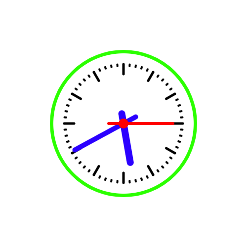
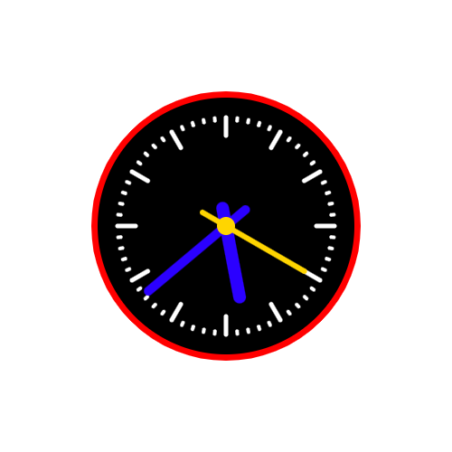

# Animation Clock Project



## Description:

A simple Clock Animation created using Canvas element in HTML with all its content drawn using canvas context in and its animation added using the .requestAnimationFrame() method(Vanilla JavaScript)



## Steps to create a canvas drawing

1. Add a canvas element within the HTML body tags
2. Add the width and height of the canvas with the tags as attributes as well as class or id
3. Go to the linked JS file and bring in the canvas element into a variable

```js
const canvas = document.getElementById("my-canvas");
const ctx = canvas.getContext("2d");
```

4. Then you can draw each component of the drawing such as circle, line, Rectangle etc

```js
// Draw a line
ctx.strokeStyle = "#000";
ctx.lineWidth = 5;
ctx.beginPath();
ctx.moveTo(x, y);
ctx.lineTo(x, y);
ctx.stroke();

// Draw a circle
ctx.arc(x, y, radius, startAngle, endAngle, clockwise);
ctx.fill();
ctx.stroke();
// Note that direction  is either true or false
```
